# 🌌 NeoGuard

[](https://flutter.dev)
[](https://dart.dev)
[](LICENSE)

**NeoGuard** is a comprehensive Flutter application that educates users about Near-Earth Objects (NEOs) and provides real-time asteroid tracking, impact simulation, interactive 3D visualization, and an engaging space defense game. Built with NASA's official APIs, NeoGuard combines education with entertainment to raise awareness about planetary defense.

---

## 📱 Features

### 🎯 Core Features

#### 1. **NEO Dashboard** 📊
- Real-time tracking of Near-Earth Objects using NASA's NeoWs API
- Interactive timeline view of asteroid approaches
- Detailed information about each NEO (size, velocity, distance, hazard status)
- Statistics cards showing total NEOs, hazardous asteroids, and close approaches

#### 2. **Asteroid Impact Calculator** 💥
- Physics-based simulation of asteroid impact effects
- Calculates energy release, crater dimensions, seismic effects
- Tsunami wave generation and propagation analysis
- Visual severity indicators and warnings
- Adjustable parameters: diameter, velocity, impact angle, density

#### 3. **NASA Eyes on Asteroids** 🔭
- Embedded NASA's Eyes on Asteroids 3D visualization
- Interactive exploration of asteroid trajectories
- Real-time orbital data visualization
- WebView integration with NASA's official tools

#### 4. **Education Center** 📚
- Comprehensive definitions of astronomical terms
- Educational videos about asteroids and planetary defense
- Quiz system with multiple difficulty levels (Easy, Medium, Hard)
- Interactive learning resources

#### 5. **Meteor Madness Game** 🎮
- Action-packed space defense game built with Flame engine
- Three difficulty levels (Easy, Normal, Hard)
- Multiple weapon systems (Normal Shot, Triple Shot, Laser)
- Progressive wave system with increasing difficulty
- Shield mechanics and upgrade system
- High score tracking

---

## 🏗️ Architecture

NeoGuard follows **Clean Architecture** principles with a feature-based modular structure, ensuring separation of concerns, testability, and maintainability.

### Architecture Overview

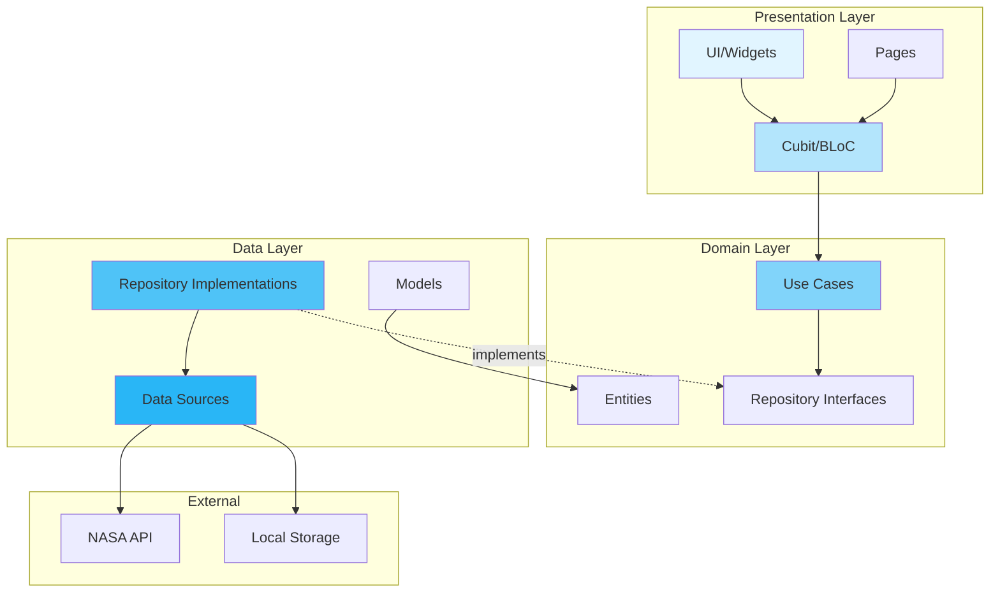

### Feature Structure

Each feature follows a consistent three-layer architecture:

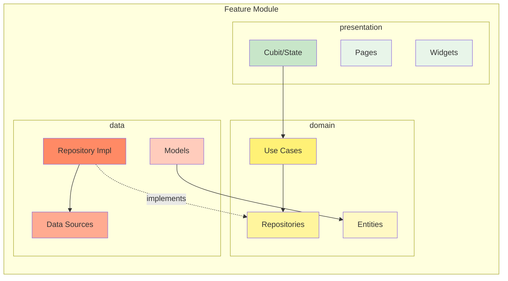

### Directory Structure

```
lib/
├── core/                          # Core functionality
│   ├── di/                        # Dependency Injection (GetIt)
│   │   └── service_locator.dart
│   ├── network/                   # Network clients
│   │   └── dio_client.dart
│   ├── router/                    # Navigation & routing
│   │   ├── app_routers.dart
│   │   └── routes.dart
│   ├── storage/                   # Local storage utilities
│   │   └── cache_helper.dart
│   └── theme/                     # App theming
│       └── app_colors.dart
│
├── features/                      # Feature modules
│   ├── home/                      # Landing page
│   │   └── presentation/
│   │
│   ├── dashboard/                 # NEO Dashboard
│   │   ├── data/
│   │   │   ├── datasources/       # NASA API integration
│   │   │   ├── models/            # Data models
│   │   │   └── repositories/      # Repository implementations
│   │   ├── domain/
│   │   │   ├── entities/          # Business entities
│   │   │   ├── repositories/      # Repository interfaces
│   │   │   └── usecases/          # Business logic
│   │   └── presentation/
│   │       ├── cubit/             # State management
│   │       ├── pages/             # Screen UI
│   │       └── widgets/           # Reusable components
│   │
│   ├── asteroid_impact/           # Impact Calculator
│   │   ├── data/
│   │   ├── domain/
│   │   └── presentation/
│   │
│   ├── nasa_eyes/                 # NASA Eyes WebView
│   │   └── presentation/
│   │
│   ├── meteor_madness/            # Game
│   │   └── presentation/
│   │       ├── cubit/
│   │       ├── game/              # Flame game engine
│   │       │   └── components/    # Game components
│   │       ├── screens/
│   │       └── widgets/
│   │
│   ├── education/                 # Learning resources
│   │   └── presentation/
│   │
│   └── quiz/                      # Quiz system
│       ├── data/
│       └── presentation/
│
├── main.dart                      # App entry point
└── neo_guard_app.dart             # Root app widget
```

---

## 📊 Data Flow

### NEO Dashboard Data Flow

This diagram illustrates the complete data flow for fetching and displaying Near-Earth Object data:

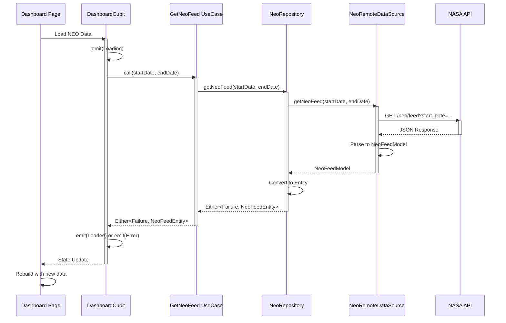

### Impact Calculator Flow

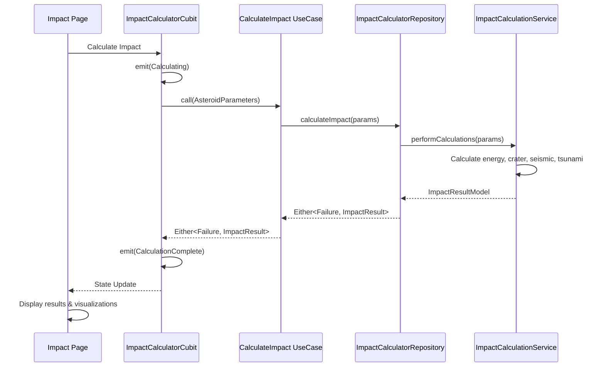

---

## 🔧 Dependency Injection

NeoGuard uses **GetIt** for dependency injection, providing a service locator pattern for managing dependencies.

### Dependency Graph

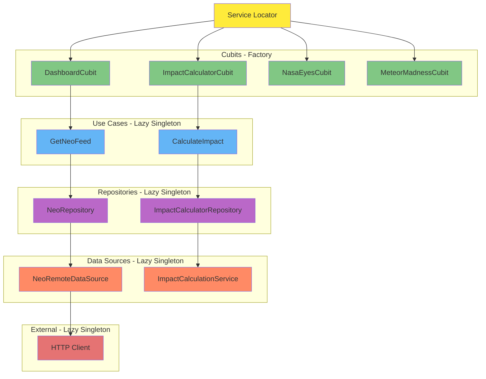

### Initialization Flow

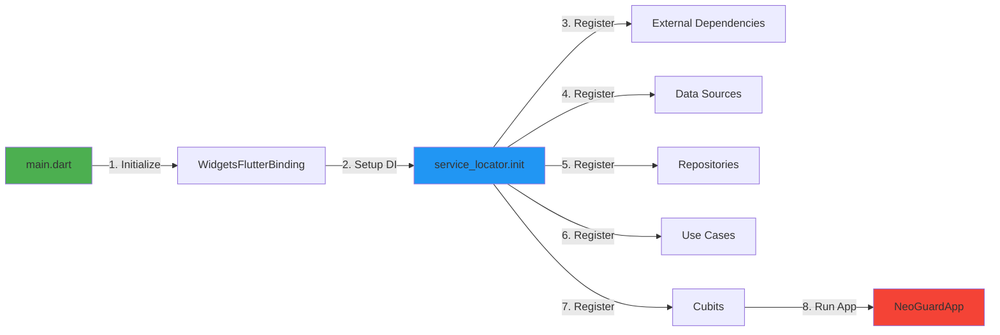

---

## 🗺️ Navigation Flow

### Route Structure

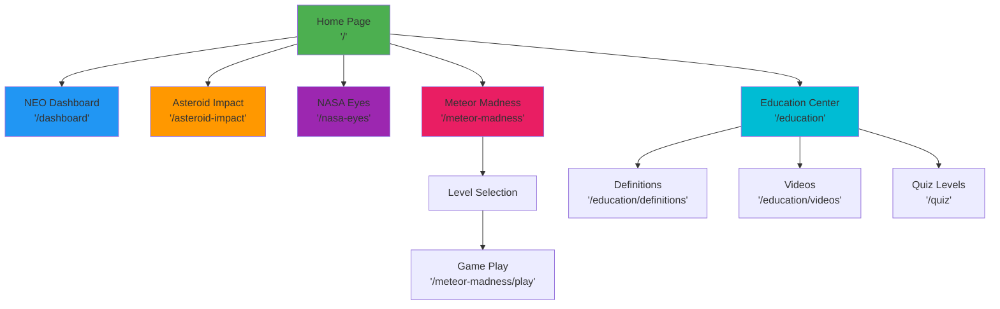

### Navigation Implementation

The app uses Flutter's imperative navigation with a centralized `AppRoutes` class:

```dart
// Route names defined in Routes class
class Routes {
  static const String home = '/';
  static const String dashboard = '/dashboard';
  static const String asteroidImpact = '/asteroid-impact';
  // ... more routes
}

// Navigation usage
Navigator.pushNamed(context, Routes.dashboard);
```

Each route automatically provides the necessary BLoC/Cubit instances through `BlocProvider`:

```dart
case Routes.dashboard:
  return MaterialPageRoute(
    builder: (_) => BlocProvider(
      create: (_) => sl<DashboardCubit>(),
      child: const DashboardPage(),
    ),
  );
```

---

## 🎯 State Management

### BLoC/Cubit Pattern

NeoGuard uses the **Cubit** pattern (simplified BLoC) for state management:

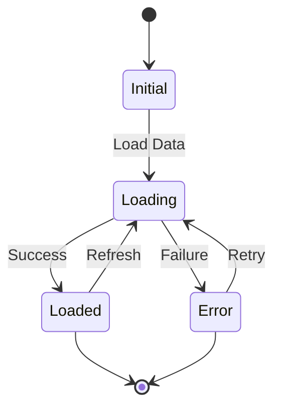

### Example: Dashboard States

```dart
// State definitions
abstract class DashboardState extends Equatable {}

class DashboardInitial extends DashboardState {}

class DashboardLoading extends DashboardState {}

class DashboardLoaded extends DashboardState {
  final NeoFeedEntity neoFeed;
}

class DashboardError extends DashboardState {
  final String message;
}
```

### State Flow Example

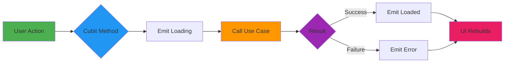

---

## 🚀 Getting Started

### Prerequisites

- **Flutter SDK**: >=3.9.0
- **Dart SDK**: >=3.9.0
- **IDE**: Android Studio, VS Code, or IntelliJ IDEA
- **Platforms**: Android, iOS, Web, Windows, Linux, macOS

### Installation

1. **Clone the repository**
   ```bash
   git clone https://github.com/yourusername/neo_guard.git
   cd neo_guard
   ```

2. **Install dependencies**
   ```bash
   flutter pub get
   ```

3. **Run the app**
   ```bash
   # Run on your default device
   flutter run
   
   # Or specify a platform
   flutter run -d chrome        # Web
   flutter run -d windows       # Windows
   flutter run -d android       # Android
   flutter run -d ios          # iOS
   ```

### Building for Production

```bash
# Android APK
flutter build apk --release

# Android App Bundle
flutter build appbundle --release

# iOS
flutter build ios --release

# Web
flutter build web --release

# Windows
flutter build windows --release
```

---

## 📦 Key Dependencies

### Core Dependencies

| Package | Version | Purpose |
|---------|---------|---------|
| `flutter_bloc` | ^9.1.1 | State management |
| `get_it` | ^8.2.0 | Dependency injection |
| `dartz` | ^0.10.1 | Functional programming (Either, Option) |
| `equatable` | ^2.0.5 | Value equality for states |
| `http` | ^1.1.0 | HTTP client for API calls |
| `flutter_screenutil` | ^5.9.3 | Responsive UI design |

### Feature-Specific Dependencies

| Package | Version | Purpose |
|---------|---------|---------|
| `flame` | ^1.18.0 | Game engine (Meteor Madness) |
| `flame_audio` | ^2.1.0 | Game audio |
| `webview_flutter` | ^4.4.2 | NASA Eyes WebView |
| `video_player` | ^2.10.0 | Educational videos |
| `url_launcher` | ^6.2.1 | External links |
| `intl` | ^0.19.0 | Date formatting |
| `iconsax_flutter` | ^1.0.1 | Icon library |

### Development Dependencies

| Package | Version | Purpose |
|---------|---------|---------|
| `flutter_test` | SDK | Testing framework |
| `bloc_test` | ^10.0.0 | BLoC testing utilities |
| `mocktail` | ^1.0.4 | Mocking library |
| `build_runner` | ^2.4.6 | Code generation |
| `flutter_lints` | ^6.0.0 | Linting rules |

---

## 🧪 Testing

### Test Structure

```
test/
├── core/
│   ├── network/
│   └── di/
├── features/
│   ├── dashboard/
│   │   ├── data/
│   │   ├── domain/
│   │   └── presentation/
│   └── asteroid_impact/
│       ├── data/
│       ├── domain/
│       └── presentation/
└── helpers/
```

### Running Tests

```bash
# Run all tests
flutter test

# Run with coverage
flutter test --coverage

# Run specific test file
flutter test test/features/dashboard/presentation/cubit/dashboard_cubit_test.dart
```

### Test Example

```dart
blocTest<DashboardCubit, DashboardState>(
  'emits [Loading, Loaded] when getNeoFeed is successful',
  build: () {
    when(() => mockGetNeoFeed(any()))
        .thenAnswer((_) async => Right(mockNeoFeed));
    return DashboardCubit(mockGetNeoFeed);
  },
  act: (cubit) => cubit.loadNeoFeed(startDate, endDate),
  expect: () => [
    DashboardLoading(),
    DashboardLoaded(mockNeoFeed),
  ],
);
```

---

## 🌐 API Integration

### NASA NeoWs API

NeoGuard integrates with NASA's Near Earth Object Web Service (NeoWs):

**Base URL**: `https://api.nasa.gov/neo/rest/v1`

**Endpoints Used**:
- `/feed` - Retrieve a list of NEOs based on date range

**Authentication**: API Key required (included in source)

### Example Request Flow

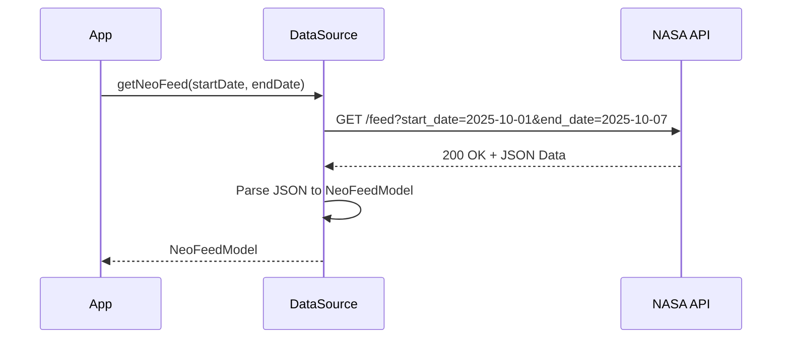

### Error Handling

```dart
try {
  final response = await client.get(url);
  
  if (response.statusCode == 200) {
    return NeoFeedModel.fromJson(json.decode(response.body));
  } else if (response.statusCode == 429) {
    throw Exception('API rate limit exceeded');
  } else if (response.statusCode == 400) {
    throw Exception('Invalid date range');
  }
} catch (e) {
  throw Exception('Network error: $e');
}
```

---

## 🎨 Design System

### Color Palette

- **Primary**: Blue (#2196F3) - Trust, space theme
- **Secondary**: Purple (#9C27B0) - Innovation, mystery
- **Accent**: Indigo (#3F51B5) - Depth, sophistication
- **Success**: Green (#4CAF50) - Safe, positive
- **Warning**: Orange (#FF9800) - Caution, attention
- **Danger**: Red (#F44336) - Hazard, critical

### Theme Configuration

```dart
// Dark theme optimized for space aesthetic
ThemeData(
  brightness: Brightness.dark,
  primaryColor: AppColors.blue600,
  scaffoldBackgroundColor: AppColors.background,
  // ... more configuration
)
```

### Responsive Design

Using `flutter_screenutil` for responsive layouts:

```dart
ScreenUtilInit(
  designSize: const Size(375, 812), // iPhone X base
  minTextAdapt: true,
  splitScreenMode: true,
  // ...
)
```

---

## 🎮 Game Architecture (Meteor Madness)

### Flame Engine Integration

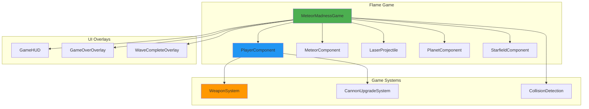

### Game Loop

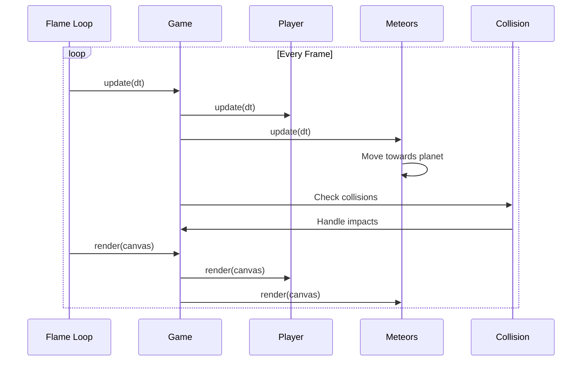

---

## 📱 Screenshots & Features

### Feature Matrix

| Feature | Dashboard | Impact Calc | NASA Eyes | Education | Game |
|---------|-----------|-------------|-----------|-----------|------|
| Real-time Data | ✅ | ❌ | ✅ | ❌ | ❌ |
| Interactive | ✅ | ✅ | ✅ | ✅ | ✅ |
| Educational | ✅ | ✅ | ✅ | ✅ | ✅ |
| Gamified | ❌ | ❌ | ❌ | ✅ | ✅ |
| Offline Mode | ❌ | ✅ | ❌ | ✅ | ✅ |

---

## 🤝 Contributing

Contributions are welcome! Please follow these guidelines:

1. **Fork the repository**
2. **Create a feature branch** (`git checkout -b feature/amazing-feature`)
3. **Follow the existing architecture** (Clean Architecture + Feature-based)
4. **Write tests** for new features
5. **Update documentation** as needed
6. **Commit changes** (`git commit -m 'Add amazing feature'`)
7. **Push to branch** (`git push origin feature/amazing-feature`)
8. **Open a Pull Request**

### Code Style

- Follow [Effective Dart](https://dart.dev/guides/language/effective-dart) guidelines
- Use `flutter_lints` package rules
- Format code with `flutter format .`
- Run analyzer: `flutter analyze`

---

## 📄 License

This project is licensed under the MIT License - see the [LICENSE](LICENSE) file for details.

---

## 👥 Authors

- **Your Name** - *Initial work*

---

## 🙏 Acknowledgments

- **NASA** - For providing the NEO API and Eyes on Asteroids visualization
- **Flutter Team** - For the amazing framework
- **Flame Engine** - For the game engine
- **Open Source Community** - For the excellent packages used in this project

---

## 📞 Support

For support, email support@neoguard.app or open an issue in the repository.

---

## 🗺️ Roadmap

### Version 1.1
- [ ] Add user authentication
- [ ] Implement local caching for offline mode
- [ ] Add more quiz questions
- [ ] Implement leaderboard system

### Version 1.2
- [ ] Add asteroid 3D visualization
- [ ] Implement push notifications for close approaches
- [ ] Add social sharing features
- [ ] Multi-language support

### Version 2.0
- [ ] AR features for asteroid visualization
- [ ] Community features and discussions
- [ ] Advanced impact simulation with machine learning
- [ ] Integration with more NASA APIs

---

## 📊 Project Statistics

- **Lines of Code**: ~15,000+
- **Number of Features**: 6
- **Test Coverage**: Target 80%
- **Supported Platforms**: 6 (Android, iOS, Web, Windows, Linux, macOS)

---

<div align="center">

**Made with ❤️ and ☕ by the NeoGuard Team**

[Website](https://neoguard.app) • [Documentation](https://docs.neoguard.app) • [Report Bug](https://github.com/yourusername/neo_guard/issues) • [Request Feature](https://github.com/yourusername/neo_guard/issues)

</div>
